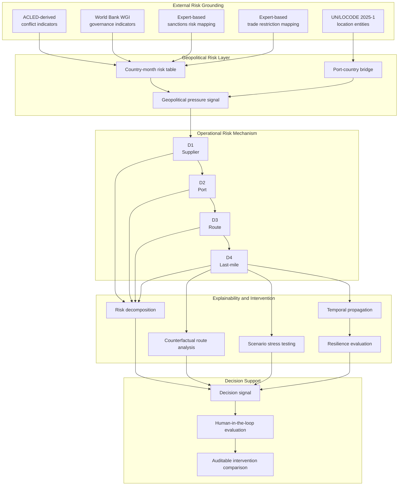
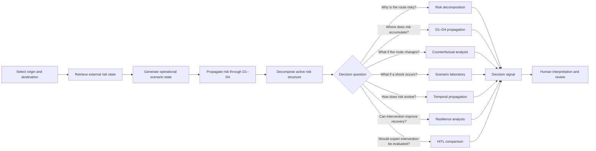

# RYPE — Explainable Operational Risk Intelligence

> From risk scoring to explainable, intervention-oriented decision support.

## Repository Architecture Update — v0.6

RYPE v0.6 separates the Streamlit decision interface from the analytical engine. The app remains deployable through Streamlit Cloud, while data loading, geopolitical-risk grounding, route-risk inference, counterfactual analysis, decision-signal generation and UI helpers are organized under `src/rype/`.

```text
src/rype/
├── data_loader.py
├── geo_risk.py
├── route_engine.py
├── counterfactual.py
├── decision_signals.py
├── ui_helpers.py
└── ui_controls.py
```

The release also adds a mobile-accessible Route Control Center so route selection does not depend exclusively on the collapsed Streamlit sidebar on narrow screens.


**RYPE — Risk Yield Propagation Engine** is a research prototype for explainable geopolitical and operational supply-chain risk intelligence.

Rather than treating supply-chain risk as a single prediction score, RYPE investigates how externally grounded risk signals can enter an operational system, propagate across interconnected decision nodes, and change under alternative interventions.

The prototype integrates geopolitical risk grounding, mechanism-driven D1–D4 risk propagation, explainable risk decomposition, counterfactual scenario analysis, resilience evaluation, and human-in-the-loop decision support within a unified research interface.

---

## Research Motivation

A high risk score alone does not answer the questions a decision-maker actually faces:

- Where does the risk originate?
- How does it propagate through the operational chain?
- Which node concentrates the exposure?
- What changes under an alternative route or intervention?
- Can a human decision improve the system state?
- Is the model explaining operational mechanisms or merely reproducing information already embedded in the data?

RYPE was developed around these questions.

The research process also includes a methodological investigation of data leakage and apparently near-perfect predictive performance. Instead of accepting unusually strong model results at face value, the project examines whether target-related information is structurally embedded in the feature space and distinguishes predictive performance from genuine operational realism.

This methodological inquiry forms an important part of the project's research context.

## Research Evolution

RYPE emerged from a methodological anomaly rather than from a predetermined platform architecture.


The project initially investigated predictive operational risk modeling across integrated delivery, logistics, order-return, and supply-chain risk structures.

An apparently near-perfect classification result became a methodological turning point. Rather than treating the result as evidence of model superiority, the project investigated whether target-related information was structurally embedded in the feature space.

Subsequent reconstruction experiments questioned whether a black-box disruption score represented recoverable operational mechanisms.

This led to the central methodological distinction underlying RYPE:

> **Predictive performance does not necessarily imply operational realism.**

RYPE therefore evolved from a risk-prediction experiment into an explainable operational risk intelligence prototype focused on risk grounding, propagation, intervention, and decision support.

---

## System Architecture

### RYPE Research Architecture



RYPE is organized as a layered research architecture.

The external-risk layer grounds the system in geopolitical and institutional signals. The operational layer represents propagation across supplier, port, route, and last-mile mechanisms. The intervention layer evaluates how alternative decisions or stress conditions change the system state. The final layer translates these results into interpretable and auditable decision-support signals.

The architecture should not be interpreted as a fully estimated causal graph. D1–D4 propagation coefficients are expert-guided prototype parameters and are not claimed to have been estimated from observed historical disruption outcomes.

RYPE represents operational risk through four mechanism-oriented propagation nodes:

| Node | Operational interpretation |
|---|---|
| **D1 — Supplier** | Supplier and upstream operational exposure |
| **D2 — Port** | Port, customs, handling, and logistics-process exposure |
| **D3 — Route** | Transportation and route-level propagation |
| **D4 — Last-mile** | Downstream delivery and final operational exposure |

External geopolitical pressure is grounded using country-level risk indicators and connected to operational states through a route-level risk inference layer.

The system then evaluates how risk propagates across D1 → D2 → D3 → D4.

---

## External Risk Grounding

The current research layer incorporates signals derived from:

- ACLED political violence and conflict indicators
- World Bank Worldwide Governance Indicators
- Expert-based sanctions risk mapping
- Expert-based trade-restriction risk mapping
- UN/LOCODE port and location entities
- Logistics, delivery, and e-commerce operational datasets

These signals are used to construct an externally grounded geopolitical risk layer.

The current MVP uses a country-month geopolitical risk table and a UN/LOCODE-based location bridge for route-level entity grounding.

UN/LOCODE **2025-1** is used as the location-code layer.

The exact ACLED snapshot period, WGI input period, and selected external-data provenance details remain subject to repository-level data audit and are therefore not overstated in the current documentation.

The existence of an external geopolitical signal does not automatically imply operational realism. RYPE explicitly treats this distinction as a methodological concern:

> **External Risk Realism ≠ Operational Realism**

---

## Data Provenance and Research Inputs

RYPE combines operational research datasets with external geopolitical and location-based signals.

### Operational Dataset Structures

DF1–DF4 were constructed to represent four groups of operational variables:

| Structure | Variable domain |
|---|---|
| **DF1** | Delivery and location variables |
| **DF2** | Logistics and operational-process variables |
| **DF3** | Order and return variables |
| **DF4** | Supplier and supply-chain risk variables |

The development of these structures drew on the Amazon Delivery Dataset, Logistics and Supply Chain Dataset, Synthetic Dataset for E-Commerce Return Analysis, and the simulation-based supply-chain risk time-series dataset published by Banerjee through Mendeley Data.

The Mendeley dataset was generated through simulation of probabilistic risk-assessment and linear-programming models using MATLAB Simulink and was designed for supply-chain risk modeling research.

### External Risk and Entity Layers

| Layer | Current RYPE treatment |
|---|---|
| Conflict | Country-month conflict indicators derived from aggregated ACLED data |
| Governance | World Bank Worldwide Governance Indicators |
| Sanctions | Expert-based manual sanctions-risk mapping |
| Trade restriction | Expert-based manual trade-restriction mapping |
| Location entities | UN/LOCODE 2025-1 |
| Geopolitical pressure weights | Prototype design assumption |
| D1–D4 propagation coefficients | Expert-guided prototype coefficients |

The geopolitical-pressure weighting structure and D1–D4 propagation coefficients are prototype design parameters.

They are not presented as coefficients statistically estimated from historical disruption outcomes.

Future work should calibrate these parameters against observed disruption events and evaluate probabilistic calibration, temporal validity, and out-of-sample stability.

---

## Core Research Components

### 1. Geopolitical Risk Grounding

Conflict, governance fragility, sanctions, and trade-restriction signals are integrated into an external geopolitical pressure layer.

### 2. Mechanism-Driven D1–D4 Risk Propagation

Risk is represented as a sequential operational mechanism rather than a single isolated score.

The interface exposes supplier, port, route, and last-mile risk states to show where exposure accumulates across the chain.

### 3. Explainable Risk Decomposition

RYPE decomposes the active route-risk structure into interpretable contributors.

The objective is not only to identify a high-risk route, but to expose the factors and propagation states associated with the resulting risk estimate.

### 4. Counterfactual Intervention Analysis

Alternative origin nodes can be compared against the active route.

The system quantifies changes in:

- geopolitical pressure
- D1–D4 propagation states
- edge risk
- propagation-adjusted success probability

This allows RYPE to answer a decision-oriented question:

> **What changes if the operational decision changes?**

### 5. Scenario Stress Laboratory

Precomputed research scenarios evaluate the sensitivity of the propagation structure under:

- geopolitical escalation
- cyber escalation
- supplier financial stress
- port congestion shock
- last-mile disruption
- compound crisis conditions

Risk amplification and success-probability deterioration are treated as related but distinct response dimensions.

### 6. Temporal Propagation and Resilience

RYPE visualizes how instability propagates across operational nodes over sequential steps.

A separate resilience trajectory evaluates whether staged intervention reduces downstream exposure and improves the propagation-adjusted probability of operational success.

### 7. Human-in-the-Loop Decision Support

RYPE includes a Human-in-the-Loop decision layer for comparing expert intervention scenarios.

Human overrides are not assumed to improve the system automatically.

Instead, interventions are compared against a baseline using changes in chain risk and success probability.

This supports an auditable decision-support perspective:

> **Human intervention is evaluated, not automatically trusted.**

---

## Decision Intelligence Interface

The Streamlit MVP translates the research architecture into an interactive decision-support environment.

The current interface includes:

- Executive Overview
- Maritime Route Map
- D1–D4 Propagation Intelligence
- Counterfactual Intervention Analysis
- Scenario Stress Laboratory
- Temporal and Resilience Intelligence
- Human-in-the-Loop Decision Space
- Methodological Disclosure

The interface is designed to communicate three layers simultaneously:

1. **Risk state**
2. **Risk mechanism**
3. **Decision consequence**

### Decision Intelligence Flow



The RYPE interface is structured around decision questions rather than around model outputs alone.

Each analytical panel corresponds to a different decision problem:

| Decision question | RYPE component |
|---|---|
| Why is the route risky? | Explainable risk decomposition |
| Where does risk accumulate? | D1–D4 propagation |
| What changes if the route changes? | Counterfactual analysis |
| Which stressor creates the strongest impact? | Scenario laboratory |
| How does instability evolve? | Temporal propagation |
| Does staged intervention improve the state? | Resilience analysis |
| How does an expert override compare with baseline? | Human-in-the-loop evaluation |

This design reflects the project's transition from predictive modeling toward intervention-oriented decision intelligence.

---

## Maritime Route Visualization

The current route layer visualizes estimated maritime corridors using known sea-waypoints for selected major shipping lanes.

The visualization is intended as a route-context layer and **must not be interpreted as a live vessel track**.

Current route paths are estimated maritime corridors.

### Planned AIS Extension

A future AIS integration layer may introduce:

- live vessel position
- vessel speed anomaly
- ETA drift
- route deviation
- port approach behavior
- dynamic maritime congestion signals

AIS is intentionally presented as a planned extension rather than as an existing capability of the current MVP.

---

## Methodological Positioning

RYPE does not claim novelty from the first use of machine learning, SHAP, scenario analysis, or human-in-the-loop methods individually.

Its contribution lies in integrating:

- a data-leakage-driven methodological inquiry
- externally grounded geopolitical risk indicators
- mechanism-driven D1–D4 operational risk propagation
- explainable risk decomposition
- counterfactual intervention analysis
- resilience evaluation
- human-in-the-loop decision support

within a single research prototype.

The central research perspective is that operational risk intelligence should move beyond predictive accuracy toward **mechanism understanding, uncertainty-aware interpretation, and intervention-oriented decision support**.

---

## Scope and Limitations

RYPE is a **research MVP and decision-support demonstrator**.

It is not currently:

- a live shipment monitoring platform
- an AIS vessel-tracking system
- an autonomous route optimizer
- an industrial ERP or TMS integration
- a production-grade operational command system

The dynamic route engine currently uses origin-node geopolitical pressure as the primary external trigger.

The destination port provides route context and visualization.

Scenario, temporal, resilience, and HITL panels use precomputed research experiment outputs.

These boundaries are disclosed intentionally to preserve methodological transparency.

---

## Planned Research Extensions

Future development directions include:

- AIS vessel-position integration
- live ETA drift and route-deviation signals
- real-time port congestion feeds
- ERP and shipment-event integration
- temporal event grounding
- observed disruption outcomes
- uncertainty quantification
- probabilistic calibration
- survival-based disruption modeling
- dynamic Bayesian risk propagation
- advanced network-based risk diffusion
- operational Human-in-the-Loop governance

---

## Selected References and Data Sources

RYPE is positioned within existing research on machine-learning-based supply-chain risk management, cascading risk propagation, explainable artificial intelligence, and intervention-oriented decision support.

The project does not claim novelty from the first use of these methods individually. Its research contribution is positioned in the integration of a data-leakage-driven methodological inquiry with external geopolitical risk grounding, mechanism-driven D1–D4 risk propagation, explainability, counterfactual intervention analysis, and Human-in-the-Loop decision support within a unified research prototype.

### Research Literature

1. Yang, M., Lim, M. K., Qu, Y., Ni, D., & Xiao, Z. (2023). *Supply chain risk management with machine learning technology: A literature review and future research directions*. **Computers & Industrial Engineering, 175**, 108859. https://doi.org/10.1016/j.cie.2022.108859

2. Zhu, X., Zhu, J., Regan, D., & Wen, Z. (2026). *Exploring cascading failures in supply chain risk management: A systematic review, 2013–2024*. **Journal of Safety Science and Resilience, 7**(2), 100234. https://doi.org/10.1016/j.jnlssr.2025.100234

3. Ordibazar, A. H., Hussain, O., & Saberi, M. (2022). *A recommender system and risk mitigation strategy for supply chain management using the counterfactual explanation algorithm*. In **Service-Oriented Computing – ICSOC 2021 Workshops** (pp. 103–116). Springer.

4. Lundberg, S. M., & Lee, S.-I. (2017). *A Unified Approach to Interpreting Model Predictions*. **Advances in Neural Information Processing Systems, 30**.

### Operational Research Datasets

The DF1–DF4 operational structures were developed using variables and data structures informed by the following datasets:

- **Amazon Delivery Dataset** — Kaggle; dataset metadata indicates an MIT license.
- **Logistics and Supply Chain Dataset** — Kaggle; repository documentation should be consulted for current licensing conditions.
- **Synthetic Dataset for E-Commerce Return Analysis** — Kaggle.
- Banerjee, H., Saparia, G., Ganapathy, V., Garg, P., & Shenbagaraman, V. M. (2019). *Time Series Dataset for Risk Assessment in Supply Chain Networks*. **Mendeley Data, V2**. https://doi.org/10.17632/gystn6d3r4.2

The Banerjee dataset is a simulation-based academic supply-chain risk time-series dataset generated using probabilistic risk-assessment and linear-programming models in a MATLAB Simulink environment.

### External Risk and Institutional Sources

- **Armed Conflict Location & Event Data Project (ACLED)** — aggregated political-violence data used to construct country-month conflict indicators.
- **World Bank Worldwide Governance Indicators (WGI)** — governance indicators used in the external risk layer.
- **United Nations Economic Commission for Europe (UNECE), UN/LOCODE 2025-1** — location-code and port-context entity layer.

### Data Provenance and Modeling Assumptions

The repository intentionally distinguishes externally sourced data from expert-guided and prototype-design assumptions.

| Component | Current treatment |
|---|---|
| ACLED conflict signal | Country-month indicators derived from aggregated ACLED data |
| WGI governance signal | Governance indicators including PV.EST, GE.EST, RQ.EST, RL.EST, and CC.EST |
| Sanctions risk | Expert-based manual risk mapping |
| Trade-restriction risk | Expert-based manual risk mapping |
| UN/LOCODE | UN/LOCODE 2025-1 |
| Geopolitical-pressure weights | Prototype design assumption |
| D1–D4 propagation coefficients | Expert-guided propagation parameters |

The exact ACLED export snapshot and WGI input period remain subject to artefact-level provenance verification and are therefore not overstated in the current repository documentation.

The sanctions-risk and trade-restriction variables in the current MVP are **not presented as direct integrations of EU or OFAC sanctions databases**.

The geopolitical-pressure weighting structure is a prototype design assumption.

The D1–D4 propagation coefficients are expert-guided parameters and were **not estimated from observed historical disruption outcomes**.

Future research should calibrate these parameters against observed disruption events and evaluate temporal validity, probabilistic calibration, uncertainty, and out-of-sample stability.

### Citation and Provenance Principle

RYPE follows a conservative documentation principle:

> **A data source, parameter origin, or methodological claim is only presented at the level supported by the currently verified research artefacts.**

This distinction is particularly important for separating external-data realism, prototype assumptions, and empirically estimated operational mechanisms.

---

## Technology Stack

- Python
- Streamlit
- pandas
- NumPy
- Plotly

Research workflow components include statistical modeling, machine learning, explainability, scenario analysis, and decision-support design.

---

## Repository Structure

```text
rype-risk-intelligence/
├── app.py
├── README.md
├── requirements.txt
└── data/
    ├── real_external_geo_risk_table.csv
    ├── real_port_country_bridge.csv
    ├── propagation_df.csv
    ├── scenario_df.csv
    ├── temporal_df.csv
    ├── resilience_df.csv
    ├── hitl_df.csv
    └── metadata.json
```

---

## Run Locally

Clone the repository and install the required dependencies:

```bash
pip install -r requirements.txt
```

Run the Streamlit application:

```bash
streamlit run app.py
```

---

## Research Status

**Current version:** RYPE MVP v0.5 — Feature Freeze Decision Intelligence Interface

The current release represents a deployable research demonstrator built from the RYPE experimental workflow.

The project remains under active methodological and research development.

---

## Author

**Meriç Özcan**

Statistics Student  
Risk Modeling & Decision Science  
Explainable AI & Quantitative Research

---

## Disclaimer

RYPE is an academic research prototype.

Outputs are intended for research, methodological demonstration, and decision-support experimentation.

They should not be interpreted as autonomous operational, financial, compliance, sanctions, or maritime navigation decisions.
